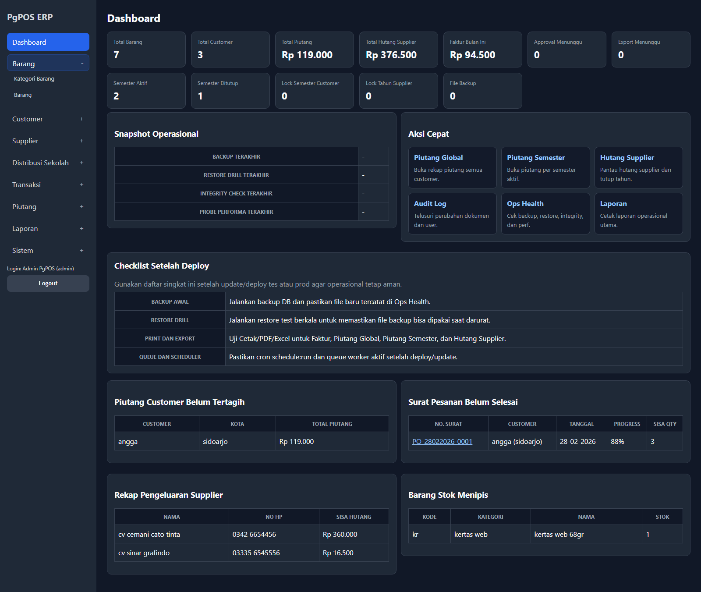
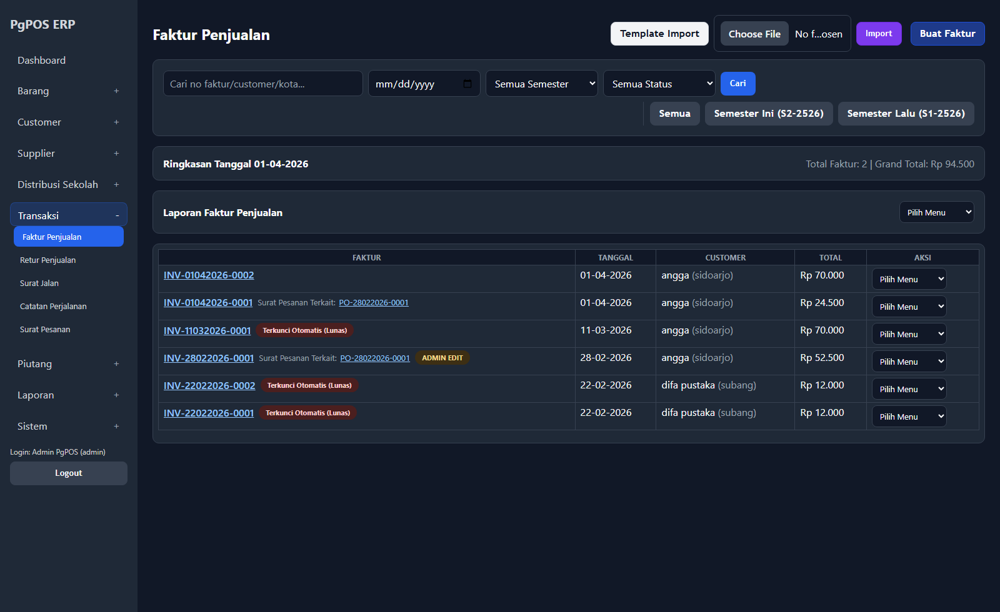
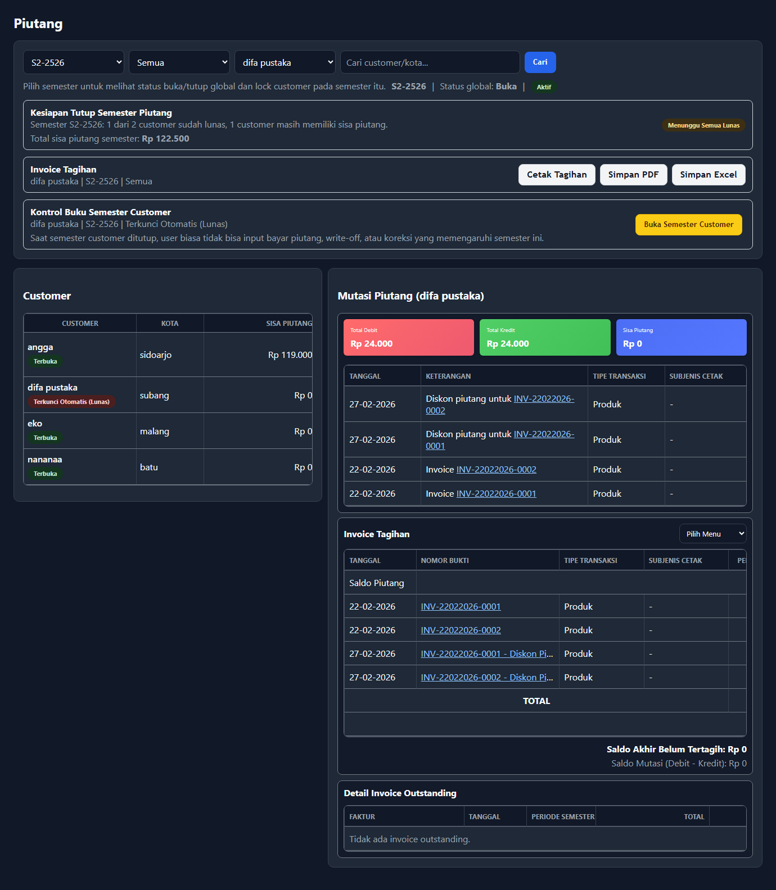
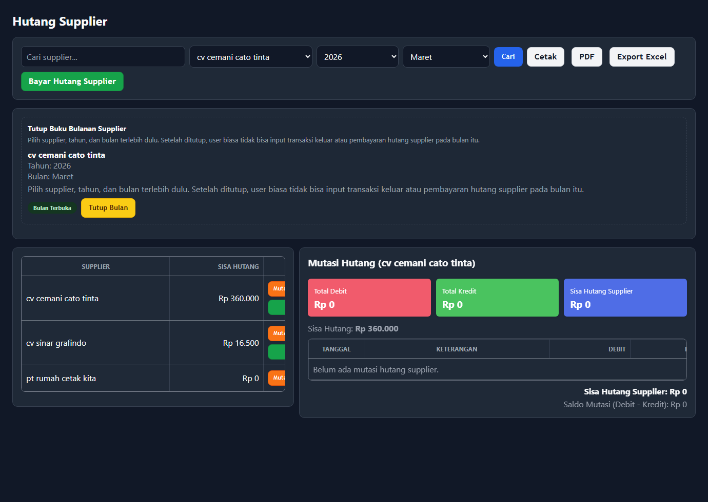
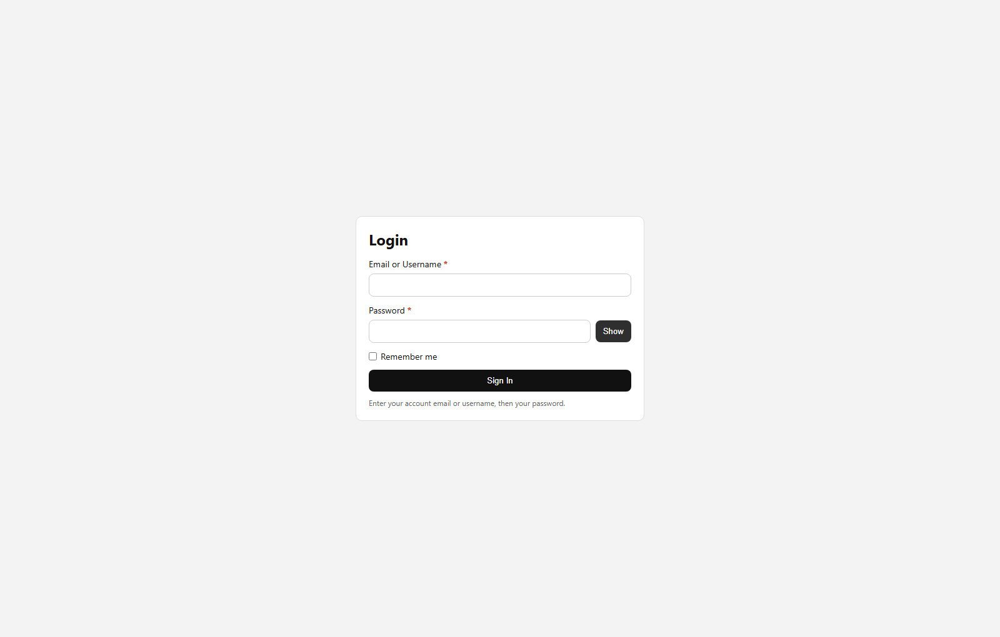

# Panduan Admin - Semua Jenis Transaksi

Dokumen ini ditujukan untuk admin, supervisor, atau pemilik usaha yang mengawasi transaksi.

Tujuan dokumen ini:
- menjelaskan peran admin per menu
- menjelaskan kapan admin perlu masuk
- memberi contoh tindakan dan keputusan admin

## Akun login default

### Admin
- Username: `admin`
- Email: `admin@pgpos.local`
- Password: `@Passwordadmin123#`

### User
- Username: `user`
- Email: `user@pgpos.local`
- Password: `@Passworduser123#`

Gunakan akun user untuk uji hak akses harian, dan gunakan akun admin untuk setup, koreksi, lock, dan monitoring.
Login bisa memakai username atau email.



## 1. Tugas utama admin

Admin bertanggung jawab untuk:
- memeriksa data transaksi
- melakukan koreksi bila perlu
- mengelola hak akses user
- menutup periode customer
- menutup tahun supplier
- memantau audit log
- memantau backup dan `Ops Health`

## 2. Perbedaan user dan admin

### User
- input transaksi harian
- lihat data
- print / export sesuai hak akses
- ajukan koreksi

### Admin
- semua hak user
- edit / cancel transaksi sensitif
- lock / unlock periode
- approve / review koreksi
- pantau kesehatan aplikasi

## 3. Faktur Penjualan



### Flow kontrol faktur penjualan

```text
User buat faktur
-> Admin cek customer, item, qty, dan metode pembayaran
-> Jika kredit, pastikan piutang bertambah
-> Jika ada salah input, koreksi atau batalkan transaksi
-> Cek ulang stok, piutang, dan audit log
```

### Tugas admin
- review invoice yang salah
- edit transaksi jika memang perlu
- batalkan transaksi bila dokumen salah total
- cek dampaknya ke:
  - stok
  - piutang
  - audit log

### Tipe transaksi
Di form admin sekarang ada field:
- `Tipe Transaksi`
- `Subjenis Cetak` (muncul saat tipe = `Cetak`)

Opsi:
- `Produk`
- `Cetak`

Default:
- `Produk`

Aturan `Subjenis Cetak`:
- dikunci per customer
- customer A bisa punya `LKS`, `KBR`
- customer B bisa punya `Buku Cerita`, `Majalah`
- admin tidak perlu membuat daftar global panjang
- jika subjenis belum ada, bisa ditambah langsung dari form transaksi

### Contoh
- user salah pilih metode pembayaran `Tunai`, harusnya `Kredit`
- admin buka detail faktur
- admin koreksi transaksi
- admin cek mutasi piutang customer

## 4. Retur Penjualan

### Flow kontrol retur

```text
User input retur
-> Admin cek barang dan qty
-> Admin cek relasi ke invoice asal
-> Nilai piutang dikurangi sesuai retur
-> Stok dikembalikan sesuai aturan transaksi
```

### Tugas admin
- pastikan retur sesuai invoice
- pastikan alasan retur tercatat
- cek efek ke piutang dan stok
- pastikan `Tipe Transaksi` retur mengikuti transaksi asal

### Contoh
- retur karena barang rusak
- admin cek qty retur tidak melebihi qty terjual

### Kalau retur hanya sebagian

Contoh:
- invoice awal qty `10`
- customer retur qty `4`

Maka admin harus cek:
- retur memang hanya `4`
- sisa yang masih dianggap terjual = `6`
- pengurangan piutang hanya sebesar nilai `4` item itu

Ini penting agar piutang tidak langsung nol kalau ternyata yang dikembalikan hanya sebagian.

### Tipe transaksi retur
- retur juga sekarang punya field `Tipe Transaksi`
- dan `Subjenis Cetak` saat tipe = `Cetak`
- opsi:
  - `Produk`
  - `Cetak`
- default:
  - `Produk`

## 5. Surat Jalan

### Tugas admin
- pastikan alamat dan item benar
- cek dokumen cetak rapi
- koreksi jika user salah input penerima / qty

### Contoh
- kurir lapor alamat salah
- admin koreksi surat jalan sebelum dokumen dipakai lagi

## 6. Surat Pesanan

### Flow kontrol surat pesanan

```text
User buat Surat Pesanan
-> Admin cek item dan qty pesanan
-> Pantau progress pemenuhan
-> Jika baru terpenuhi sebagian, biarkan status tetap terbuka
-> Jika seluruh qty terpenuhi, pastikan status selesai
```

### Tugas admin
- pastikan item dan qty pesanan benar
- pantau status pesanan selesai / belum selesai
- cek relasi pesanan ke faktur penjualan
- cek `Tipe Transaksi` sejak awal agar cetakan dan produk toko tidak tercampur salah label

### Contoh
- customer pesan `10 item`
- baru terkirim `7`
- admin cek status belum selesai

### Contoh detail pemenuhan sebagian

Misal surat pesanan berisi:
- `Produk A` qty `10`
- `Produk B` qty `6`

Lalu yang sudah diproses ke transaksi penjualan baru:
- `Produk A` qty `5`
- `Produk B` qty `3`

Maka admin harus membaca:
- total ordered = `16`
- total fulfilled = `8`
- remaining = `8`
- progress = `50%`

Status yang benar:
- **open / belum selesai**

Surat pesanan baru boleh dianggap selesai jika:
- seluruh qty sudah terpenuhi
- remaining = `0`
- progress = `100%`

### Yang harus admin cek

Kalau user bilang `"barang baru terkirim setengah"`:
- cek progress surat pesanan
- cek sisa qty
- cek transaksi penjualan yang terhubung
- pastikan status belum berubah menjadi selesai sebelum waktunya

## 7. Catatan Perjalanan

### Tugas admin
- cek biaya perjalanan masuk akal
- cek bukti dan catatan
- print dokumen kalau dibutuhkan untuk administrasi

### Contoh
- biaya solar terlalu besar
- admin verifikasi ke supir / user input

## 8. Tanda Terima Barang

### Flow kontrol tanda terima barang

```text
Barang diterima dari supplier
-> User input Tanda Terima Barang
-> Admin cek supplier, qty, harga, dan total
-> Stok bertambah
-> Hutang supplier bertambah
-> Jika ada salah input, koreksi dan cek ulang mutasi
```

### Tugas admin
- cek stok masuk
- cek harga beli
- cek dampak ke hutang supplier
- gunakan koreksi jika ada selisih

### Contoh
- supplier kirim `100`, user input `1000`
- admin koreksi transaksi
- admin cek mutasi stok dan hutang supplier

## 9. Transaksi Sebar Sekolah

### Tugas admin
- cek distribusi per lokasi
- cek print dan export
- pastikan item sebar sesuai tujuan

### Contoh
- sekolah A kelebihan qty
- admin review transaksi distribusi

## 10. Piutang



### Flow kontrol piutang customer

```text
Invoice kredit dibuat
-> Ledger piutang bertambah
-> Retur / pembayaran / write-off mengurangi piutang
-> Admin cek mutasi
-> Jika final, semester customer bisa ditutup
```

### Tugas admin
- cek mutasi piutang per customer
- tutup / buka semester customer
- cek invoice tagihan
- cek write off / diskon jika memang diizinkan

### Kolom tipe transaksi di mutasi piutang
Sekarang mutasi piutang customer punya kolom:
- `Tipe Transaksi`
- `Subjenis Cetak`

Fungsinya:
- memisahkan mutasi yang berasal dari `Produk`
- dan mutasi yang berasal dari `Cetak`
- untuk transaksi cetak, admin bisa tahu ini piutang `LKS`, `KBR`, `Buku Cerita`, atau subjenis lain milik customer itu

### Contoh
- semester customer `S2 2526` selesai
- admin tutup semester customer
- user tidak bisa input penyesuaian lagi untuk periode itu

### Rumus dasar piutang

Di aplikasi ini, cara baca piutang adalah:

- **Piutang = Penjualan Kredit - Pembayaran - Retur - Penyesuaian Kredit**

Kalau tidak ada diskon / write off / saldo dipakai, maka rumus sederhananya:

- **Piutang = Penjualan Kredit - Pembayaran - Retur**

### Contoh hitungan admin

Customer `Angga`:

1. invoice kredit `Rp 1.500.000`
2. pembayaran `Rp 500.000`
3. retur `Rp 200.000`

Maka:

- Penjualan Kredit: `Rp 1.500.000`
- Pembayaran: `Rp 500.000`
- Retur: `Rp 200.000`
- **Sisa Piutang = Rp 800.000**

Kalau ada write off `Rp 100.000`, maka:

- **Sisa Piutang = Rp 1.500.000 - Rp 500.000 - Rp 200.000 - Rp 100.000 = Rp 700.000**

Ini yang harus cocok saat admin cek:
- `Mutasi Piutang`
- `Piutang Global`
- `Piutang Semester`

### Checklist admin saat angka piutang terasa janggal

1. cek total invoice kredit
2. cek semua pembayaran customer
3. cek retur customer
4. cek write off / diskon jika ada
5. cek audit log nomor dokumen terkait
6. baru simpulkan sisa piutang

### Beda piutang customer dan hutang supplier

- `Piutang customer`
  - aset usaha
  - customer masih punya kewajiban bayar ke kita
- `Hutang supplier`
  - kewajiban usaha
  - kita masih punya kewajiban bayar ke supplier

Jadi admin jangan mencampur:
- ledger customer
- ledger supplier
- report global customer
- report hutang supplier

### Catatan penting
- `Tipe Transaksi` tidak ditampilkan di header print dokumen transaksi
- tetapi tetap muncul di mutasi piutang customer dan laporan piutang yang relevan

## 11. Piutang Global

### Tugas admin
- lihat piutang aktif semua customer
- filter global berdasarkan `Tipe Transaksi`
- print rekap global
- print invoice ringkas per customer bila diperlukan

Opsi yang tersedia:
- semua tipe transaksi
- hanya `Produk`
- hanya `Cetak`

Filter ini berlaku untuk:
- tampilan layar
- print
- export PDF
- export Excel

### Kegunaan filter tipe transaksi
Kalau satu customer punya:
- transaksi `Produk`
- dan transaksi `Cetak`

maka admin bisa pakai filter `Tipe Transaksi` di `Piutang Global` untuk memisahkan analisa global per jenis transaksi.

### Contoh
- owner minta daftar semua customer yang masih punya saldo piutang

### Contoh baca total global

Misal:

- `Angga`: `Rp 700.000`
- `Difa Pustaka`: `Rp 0`
- `Eko`: `Rp 300.000`

Maka:
- **Total Piutang Global = Rp 1.000.000**

Admin perlu pastikan:
- semester yang ditutup tidak ikut tampil kalau memang aturan lock sudah aktif
- customer lunas tidak membingungkan user

## 12. Piutang Semester

### Tugas admin
- cek piutang per semester
- pisahkan analisa per `Tipe Transaksi` bila perlu
- export untuk analisa
- cocokkan dengan target penagihan

Opsi filter semester:
- semua tipe transaksi
- hanya `Produk`
- hanya `Cetak`

### Contoh
- admin ingin lihat rekap `S2 2526` saja

### Contoh verifikasi semester

Semester `S2 2526`:

- Penjualan Kredit total: `Rp 5.000.000`
- Pembayaran total: `Rp 3.500.000`
- Retur total: `Rp 500.000`

Maka:
- **Total Piutang Semester = Rp 1.000.000**

Admin bisa cocokkan angka ini dengan:
- total customer per semester
- total tagihan customer di semester yang sama

## 13. Bayar Piutang

### Flow kontrol bayar piutang

```text
Customer membayar tagihan
-> User input pembayaran
-> Admin cek customer, nominal, dan tanggal bayar
-> Piutang berkurang
-> Jika nominal salah, koreksi transaksi
-> Pastikan saldo akhir sesuai mutasi piutang
```

### Tugas admin
- cek pembayaran masuk
- koreksi jika user salah nominal
- batalkan bila transaksi pembayaran salah total
- pastikan kwitansi benar

### Contoh
- user input bayar `Rp 5.000.000`, harusnya `Rp 500.000`
- admin koreksi pembayaran

### Contoh pengecekan pembayaran

Sebelum pembayaran:
- piutang customer: `Rp 800.000`

Setelah bayar `Rp 300.000`:
- saldo baru harus menjadi `Rp 500.000`

Kalau setelah bayar saldo tidak sesuai:
- cek mutasi piutang
- cek apakah ada retur / write off lain
- cek audit log transaksi terkait

## 14. Hutang Supplier



### Flow kontrol hutang supplier

```text
Tanda Terima Barang dibuat
-> Ledger hutang supplier bertambah
-> Pembayaran supplier mengurangi hutang
-> Admin cek mutasi + report
-> Jika final, tahun supplier bisa ditutup
```

### Tugas admin
- cek mutasi hutang supplier
- print report per supplier / tahun / bulan
- bayar hutang supplier
- tutup / buka tahun supplier

### Contoh
- tahun `2026` sudah final
- admin tutup tahun supplier
- user tidak bisa tambah transaksi hutang baru di tahun itu

### Contoh hitungan hutang supplier

Misal:
- transaksi terima barang supplier = `Rp 300.000`
- pembayaran hutang = `Rp 100.000`

Maka:
- sisa hutang = `Rp 200.000`

Admin perlu memastikan angka ini konsisten di:
- `Hutang Supplier`
- `Mutasi Hutang`
- `Kartu Stok Supplier` bila ada transaksi stok terkait

### Pembayaran hutang supplier

Yang harus dicek admin saat ada pembayaran supplier:
- supplier yang dibayar benar
- tahun dan bulan filter benar
- nominal bayar masuk ke ledger supplier
- saldo hutang berkurang sesuai nominal
- kwitansi / bukti pembayaran sesuai

Contoh:
- hutang supplier sebelum bayar = `Rp 300.000`
- dibayar = `Rp 125.000`
- sisa hutang yang benar = `Rp 175.000`

Kalau sesudah pembayaran saldo tidak cocok:
1. cek transaksi `Tanda Terima Barang`
2. cek semua pembayaran supplier terkait
3. cek audit log
4. cek apakah tahun supplier sedang terkunci atau sudah pernah dikoreksi

## 15. Kartu Stok Supplier

### Tugas admin
- cek mutasi stok dari supplier
- print report untuk audit pembelian

### Contoh
- supplier protes jumlah barang masuk
- admin cek kartu stok supplier

### Yang perlu dicek admin

- qty masuk sesuai dokumen
- mutasi tidak meloncat
- report print/PDF/Excel konsisten
- kalau ada koreksi transaksi masuk, cek efeknya ke kartu stok supplier

## 16. Lock semester customer

### Flow kontrol lock semester customer

```text
Mutasi piutang semester diperiksa
-> Semua pembayaran, retur, dan koreksi dipastikan final
-> Admin tutup semester customer
-> User biasa tidak bisa ubah transaksi periode itu
-> Jika perlu revisi, admin buka semester kembali
```

### Kapan dilakukan
- setelah piutang periode itu sudah diverifikasi
- setelah pembayaran/retur periode itu dianggap final

### Dampaknya
- user biasa tidak bisa lagi mengubah transaksi terkait semester customer itu

### Contoh
- semester `S1 2526` customer `Angga` sudah final
- admin tutup semester customer tersebut

## 17. Lock tahun supplier

### Flow kontrol lock tahun supplier

```text
Mutasi hutang supplier 1 tahun diperiksa
-> Semua pembelian dan pembayaran dipastikan final
-> Admin tutup tahun supplier
-> User biasa tidak bisa input transaksi di tahun itu
-> Jika perlu revisi, admin buka tahun kembali
```

### Kapan dilakukan
- setelah pembelian dan pembayaran hutang supplier 1 tahun dianggap final

### Dampaknya
- user biasa tidak bisa input transaksi hutang supplier untuk tahun itu

### Contoh
- tahun `2026` supplier `CV Sinar` sudah final
- admin tutup tahun supplier

## 18. Audit log

### Tugas admin
- telusuri siapa membuat / mengubah transaksi
- filter per modul
- filter per nomor dokumen
- baca before/after kalau ada koreksi

### Contoh
- ada selisih piutang
- admin cari nomor invoice di `Audit Log`

## 19. Backup dan Ops Health



### Tugas admin
- pastikan backup ada
- pastikan restore drill ada
- pastikan integrity check dan performance probe tercatat

### Contoh command

```bash
php artisan app:db backup
php artisan app:db restore test
php artisan app:integrity check
php artisan app:smoke test
```

### Yang dicek di Ops Health
- environment
- debug mode
- latest backup
- total backup
- restore drill
- integrity guardrail
- performance probe

## 20. Import massal

### Tugas admin
- download template
- validasi file sebelum import
- lakukan import besar di env `tes` dulu
- backup sebelum import besar di `prod`

### Contoh
- import customer baru 300 data
- admin test di `tes`
- kalau aman, baru jalankan di `prod`

### Aturan aman import

Sebelum import besar:
1. backup DB
2. jalankan import di `tes`
3. validasi hasil
4. baru import ke `prod`

## 21. Pengaturan


### Tugas admin di pengaturan
- atur profil perusahaan
- kelola periode semester
- cek status aktif / tutup semester

## 22. Checklist admin harian

1. login
2. cek dashboard
3. cek transaksi penting hari itu
4. cek piutang / hutang
5. cek audit log bila ada koreksi
6. cek ops health

## 23. Checklist admin mingguan

1. cek backup
2. cek restore drill
3. cek integrity check
4. cek performa list/export
5. cek periode yang siap ditutup


