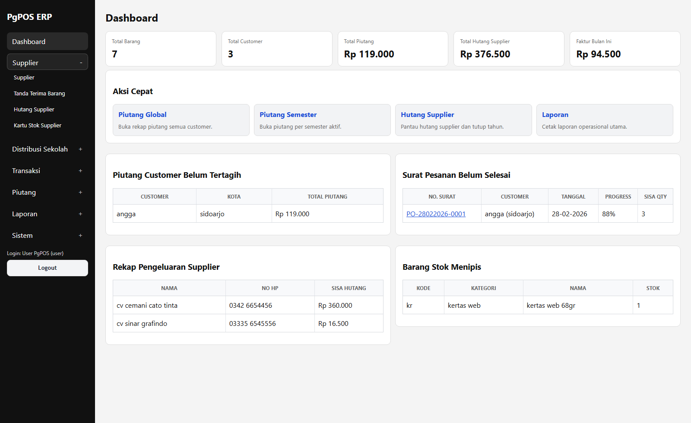
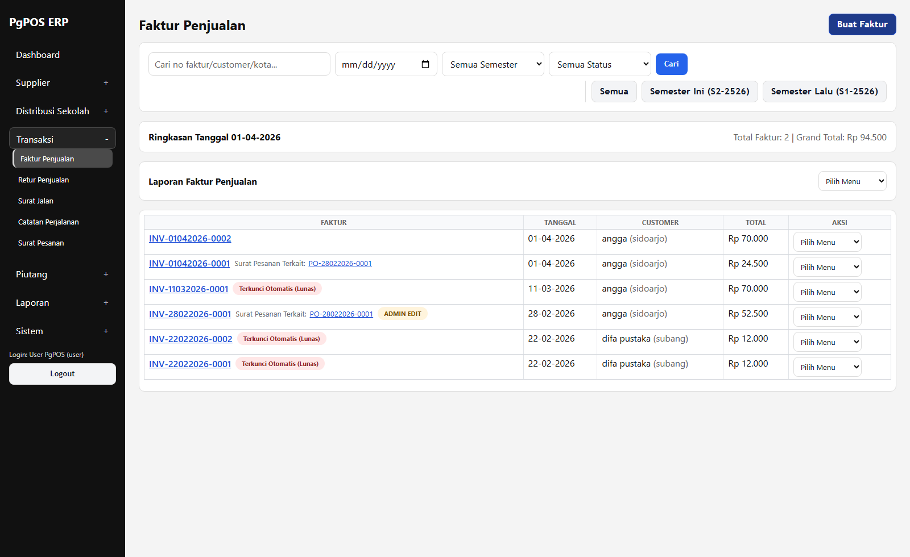
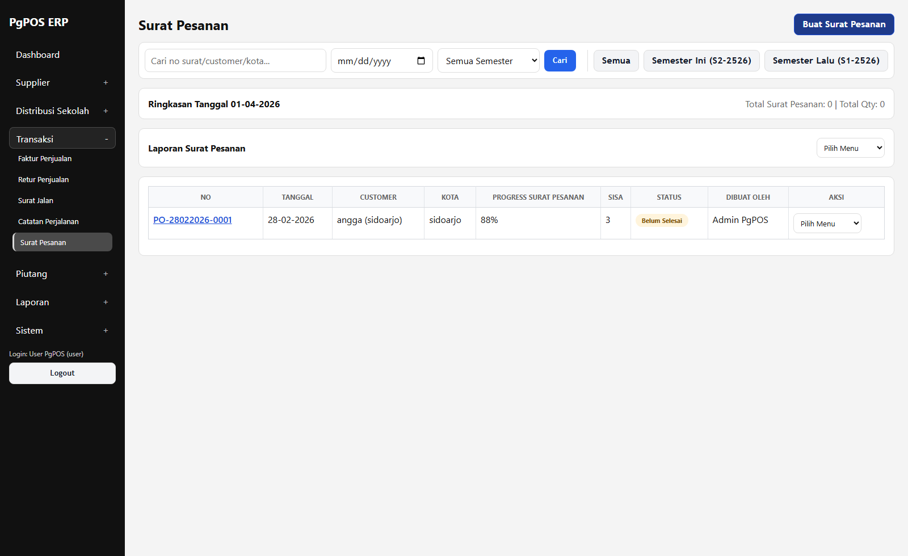
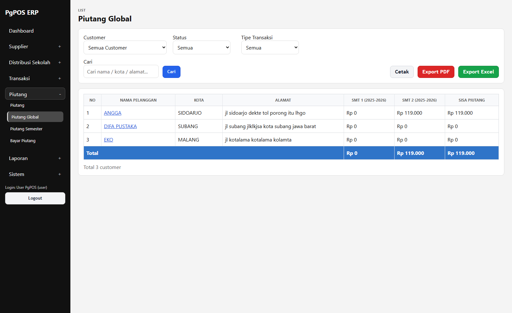
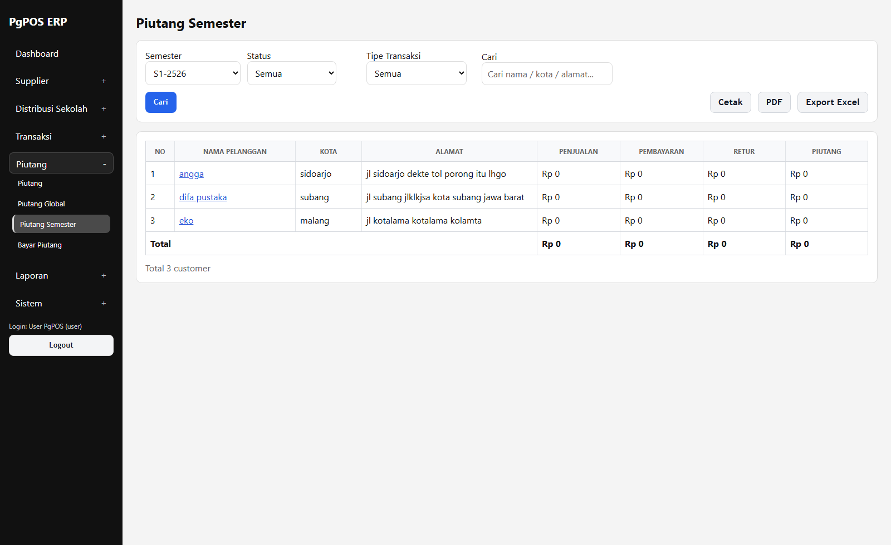
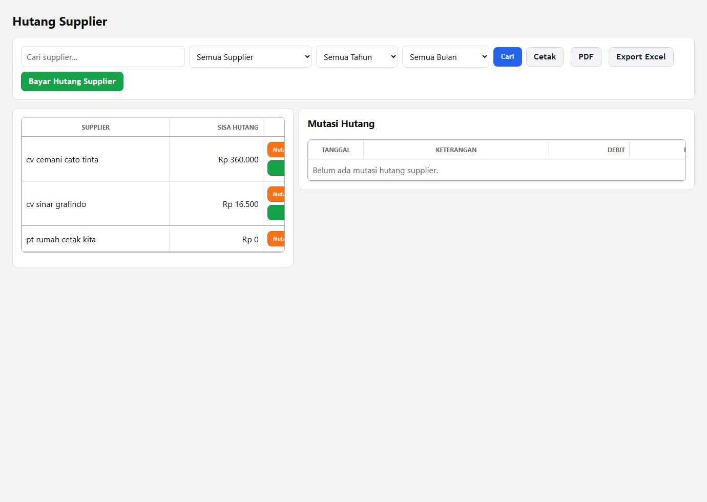

# Panduan User - Semua Jenis Transaksi

Dokumen ini ditujukan untuk user operasional harian.

Tujuan dokumen ini:
- menjelaskan menu transaksi satu per satu
- menjelaskan kapan menu dipakai
- memberi contoh alur sederhana

## Akun login default user

- Username: `user`
- Email: `user@pgpos.local`
- Password: `@Passworduser123#`

Jika admin sudah mengganti password di server, pakai password terbaru dari admin.

Login bisa memakai:
- username + password
- atau email + password



## 1. Aturan umum user

- Gunakan transaksi sesuai menu, jangan mencatat di luar sistem lalu baru disalin belakangan.
- Jika ada salah input pada transaksi yang sudah memengaruhi stok atau piutang, gunakan jalur koreksi / hubungi admin.
- Jika muncul status semester / tahun terkunci, jangan dipaksa. Itu berarti periode tersebut memang sedang dikunci.
- Untuk print dan export, gunakan tombol yang sudah tersedia di halaman masing-masing.

## 2. Faktur Penjualan



### Kapan dipakai
- saat menjual barang ke customer
- baik tunai maupun kredit

### Yang diisi
- tanggal
- customer
- tipe transaksi
- metode pembayaran
- item barang
- qty
- harga
- catatan bila perlu

### Tipe transaksi
- `Produk`
  - dipakai untuk penjualan barang biasa
- `Cetak`
  - dipakai untuk pekerjaan atau pesanan cetak

Default di form:
- `Produk`

Catatan:
- `Tipe Transaksi` tidak ditampilkan di header print dokumen transaksi
- field ini dipakai untuk pencatatan dan analisa mutasi piutang customer

### Subjenis cetak
Kalau `Tipe Transaksi = Cetak`, akan muncul field tambahan:
- `Subjenis Cetak`

Contoh:
- `LKS`
- `KBR`
- `Buku Cerita`

Aturannya:
- daftar `Subjenis Cetak` berbeda per customer
- dropdown customer lain tidak ikut bercampur
- kalau subjenis belum ada, user bisa klik tombol tambah lalu isi nama subjenis baru

### Hasil transaksi
- stok barang berkurang
- kalau kredit, piutang customer bertambah
- nomor faktur otomatis dibuat

### Contoh
- Customer `Angga`
- membeli:
  - `BHS Indonesia` qty `10`
  - `BHS Jawa` qty `5`
- pembayaran `Kredit`

Hasil:
- faktur penjualan tercatat
- piutang customer bertambah sesuai total invoice

## 3. Retur Penjualan

### Flow sederhana retur penjualan

```text
Penjualan sebelumnya ada
-> Customer mengembalikan barang
-> User buat Retur Penjualan
-> Nilai piutang/tagihan berkurang
-> Stok disesuaikan kembali
```

### Kapan dipakai
- saat customer mengembalikan barang dari penjualan sebelumnya

### Yang diisi
- tanggal retur
- customer
- tipe transaksi
- barang yang diretur
- qty
- alasan retur

### Hasil transaksi
- nilai piutang customer berkurang
- stok bisa bertambah kembali sesuai aturan transaksi

### Contoh
- Customer mengembalikan `1` buku karena rusak
- sistem mencatat retur
- nilai tagihan customer berkurang

### Kalau barang yang diretur hanya sebagian

Contoh:
- sebelumnya customer beli `10` buku
- yang diretur hanya `4` buku

Maka:
- retur dicatat hanya `4`
- sisa barang yang tetap dianggap terjual = `6`
- pengurangan piutang hanya sebesar nilai `4` buku yang diretur

Jadi retur tidak harus seluruh qty. Bisa sebagian, asalkan sesuai barang yang benar-benar dikembalikan.

### Catatan tipe transaksi retur
- pilih `Cetak` kalau retur berasal dari transaksi cetakan
- pilih `Produk` kalau retur berasal dari penjualan barang biasa
- default tetap `Produk`
- kalau pilih `Cetak`, isi juga `Subjenis Cetak` yang sesuai customer

## 4. Surat Jalan

### Kapan dipakai
- saat barang dikirim ke customer
- fokusnya dokumen pengiriman

### Yang diisi
- tanggal
- penerima
- telepon
- kota
- tipe transaksi
- alamat
- item barang
- qty
- catatan pengiriman

### Hasil transaksi
- surat jalan tercetak
- data pengiriman terdokumentasi

### Contoh
- kirim `10` buku ke `Angga`
- alamat lengkap customer diisi
- surat jalan dipakai kurir / pengantar

## 5. Surat Pesanan



### Kapan dipakai
- saat customer memesan barang lebih dulu
- sebelum dibuat faktur penjualan

### Yang diisi
- tanggal
- customer
- telepon
- kota
- tipe transaksi
- alamat
- item yang dipesan
- qty
- catatan

### Hasil transaksi
- ada dokumen pesanan
- status pesanan bisa dipantau apakah sudah selesai dikirim / belum

### Contoh
- customer pesan `5 item`
- nanti saat dibuat faktur, item bisa ditarik dari surat pesanan

### Flow sederhana surat pesanan

```text
Customer pesan barang
-> User buat Surat Pesanan
-> Barang diproses bertahap
-> Progress pesanan bertambah
-> Jika semua qty terpenuhi -> status selesai
```

### Jika pesanan baru terpenuhi sebagian

Contoh:
- di surat pesanan, customer pesan:
  - `Buku A` qty `10`
  - `Buku B` qty `6`

Lalu pada transaksi berikutnya baru dibuat penjualan untuk:
- `Buku A` qty `5`
- `Buku B` qty `3`

Maka hitungannya:
- total pesanan = `10 + 6 = 16`
- total yang sudah diproses = `5 + 3 = 8`
- sisa = `16 - 8 = 8`

Artinya:
- progress surat pesanan masih sekitar `50%`
- statusnya masih **belum selesai**
- surat pesanan tetap muncul sebagai pesanan terbuka

Kalau nanti dibuat transaksi lagi untuk sisa:
- `Buku A` qty `5`
- `Buku B` qty `3`

Maka:
- total terpenuhi = `16`
- sisa = `0`
- status berubah menjadi **selesai**

### Cara membaca progress surat pesanan

Di aplikasi, surat pesanan dipakai untuk memantau:
- total qty yang dipesan
- total qty yang sudah diproses
- sisa qty yang belum terpenuhi

Jadi kalau user bilang:
  `"barang baru terkirim setengah"`

Maka yang perlu dicek:
- progress belum `100%`
- sisa qty masih ada
- surat pesanan belum selesai

### Catatan tipe transaksi surat pesanan
- `Produk`
  - untuk pesanan barang biasa
- `Cetak`
  - untuk pesanan pekerjaan cetak
- default tetap `Produk`
- kalau pilih `Cetak`, isi juga `Subjenis Cetak` customer tersebut

## 6. Catatan Perjalanan

### Kapan dipakai
- saat ada biaya perjalanan kirim
- untuk mencatat biaya sopir / kirim

### Yang diisi
- tanggal
- nama supir
- asisten
- plat kendaraan
- biaya solar
- biaya tol
- biaya konsumsi
- biaya lain
- catatan

### Hasil transaksi
- biaya perjalanan tercatat
- bisa dicetak sebagai bukti perjalanan kirim

### Contoh
- solar `Rp 500.000`
- tol `Rp 35.000`
- konsumsi `Rp 100.000`

## 7. Tanda Terima Barang

### Kapan dipakai
- saat menerima barang dari supplier
- ini memengaruhi stok dan hutang supplier

### Yang diisi
- tanggal transaksi
- supplier
- barang
- qty
- harga
- catatan

### Hasil transaksi
- stok bertambah
- hutang supplier bertambah bila belum dibayar

### Contoh
- terima `100` buku dari supplier
- harga beli `Rp 3.000`
- hutang supplier bertambah sesuai total

### Contoh hitungan hutang supplier

Misal:
- terima barang dari supplier:
  - qty `100`
  - harga `Rp 3.000`

Maka:
- total transaksi = `100 x Rp 3.000 = Rp 300.000`
- hutang supplier bertambah `Rp 300.000`

Kalau kemudian dibayar `Rp 100.000`, maka:
- sisa hutang supplier = `Rp 300.000 - Rp 100.000 = Rp 200.000`

## 8. Transaksi Sebar Sekolah

### Kapan dipakai
- saat distribusi barang ke banyak sekolah / lokasi

### Yang diisi
- tanggal
- lokasi / sekolah
- item
- qty
- catatan

### Hasil transaksi
- transaksi distribusi sekolah tercatat
- bisa dicetak / diexport

### Contoh
- sekolah A: `20 buku`
- sekolah B: `15 buku`

## 9. Piutang

### Flow sederhana piutang customer

```text
Faktur Penjualan kredit dibuat
-> Piutang customer bertambah
-> Jika ada retur, piutang berkurang
-> Jika customer bayar, piutang berkurang
-> Jika saldo 0, status praktisnya lunas
```

### Kapan dipakai
- untuk melihat mutasi piutang per customer

### Yang bisa dilakukan
- pilih customer
- pilih semester
- lihat mutasi
- lihat invoice tagihan
- print tagihan customer

### Kolom baru di mutasi piutang
Sekarang di mutasi piutang customer ada kolom:
- `Tipe Transaksi`
- `Subjenis Cetak`

Isi kolom itu bisa:
- `Produk`
- `Cetak`

Tujuannya:
- memisahkan piutang yang berasal dari penjualan barang biasa
- dan piutang yang berasal dari pekerjaan cetak
- untuk transaksi cetak, user bisa tahu ini piutang `LKS`, `KBR`, `Buku Cerita`, atau subjenis lain

### Contoh
- pilih `Angga`
- pilih semester `S2 2526`
- lihat invoice kredit, pembayaran, retur, dan saldo akhir

### Contoh hitungan piutang

Misal transaksi customer `Angga` di semester `S2 2526`:

1. buat `Faktur Penjualan` kredit
   - total invoice: `Rp 1.000.000`
2. customer bayar sebagian
   - pembayaran: `Rp 400.000`
3. ada retur barang
   - retur: `Rp 100.000`

Maka hitungannya:

- Penjualan Kredit: `Rp 1.000.000`
- Pembayaran: `Rp 400.000`
- Retur: `Rp 100.000`
- **Sisa Piutang = Rp 1.000.000 - Rp 400.000 - Rp 100.000 = Rp 500.000**

Jadi di buku piutang customer, saldo akhirnya harus `Rp 500.000`.

Kalau customer bayar lagi `Rp 500.000`, maka:
- saldo piutang menjadi `Rp 0`
- status praktisnya: `Lunas`

### Beda piutang customer dan hutang supplier

- `Piutang customer`
  - uang yang **harus dibayar customer ke kita**
- `Hutang supplier`
  - uang yang **harus kita bayar ke supplier**

Jadi:
- kalau jual kredit ke customer -> lihat menu `Piutang`
- kalau terima barang dari supplier dan belum lunas -> lihat menu `Hutang Supplier`

## 10. Piutang Global



### Kapan dipakai
- untuk melihat rekap piutang semua customer

### Yang bisa dilakukan
- filter status
- filter tipe transaksi
- cari nama / kota
- print global
- export PDF / Excel
- kalau pilih customer, bisa jadi format invoice customer

### Filter tipe transaksi
Di `Piutang Global`, sekarang user juga bisa memfilter:
- semua tipe transaksi
- `Produk`
- `Cetak`

Kalau customer yang sama punya dua jenis transaksi, filter ini membantu melihat rekap global yang lebih fokus.

Filter ini berlaku untuk:
- tampilan di layar
- print
- export PDF
- export Excel

### Contoh
- lihat semua customer yang masih punya piutang aktif

### Contoh baca rekap global

Misal di `Piutang Global` terlihat:

- `Angga`: `Rp 500.000`
- `Difa Pustaka`: `Rp 0`
- `Eko`: `Rp 250.000`

Maka artinya:
- `Angga` masih punya tagihan `Rp 500.000`
- `Difa Pustaka` sudah tidak punya piutang aktif
- `Eko` masih punya tagihan `Rp 250.000`

Kalau ditotal:
- **Total Piutang Global = Rp 500.000 + Rp 0 + Rp 250.000 = Rp 750.000**

## 11. Piutang Semester



### Kapan dipakai
- untuk melihat rekap piutang berdasarkan semester

### Yang bisa dilakukan
- pilih semester
- filter status
- filter tipe transaksi
- cari customer
- print PDF / Excel

### Filter tipe transaksi
Di `Piutang Semester`, user bisa memilih:
- semua tipe transaksi
- `Produk`
- `Cetak`

Jadi rekap semester bisa dilihat atau dicetak:
- gabungan semua transaksi
- khusus produk toko
- khusus cetakan

### Contoh
- semester `S2 2526`
- tampil semua customer pada semester itu beserta penjualan, angsuran, retur, dan sisa piutang

### Contoh baca rekap semester

Misal semester `S2 2526`:

- Customer A
  - Penjualan: `Rp 2.000.000`
  - Pembayaran: `Rp 1.200.000`
  - Retur: `Rp 300.000`
  - Piutang: `Rp 500.000`

Hitungannya:
- `Rp 2.000.000 - Rp 1.200.000 - Rp 300.000 = Rp 500.000`

Jadi kolom `Piutang` selalu dibaca sebagai:
- **Penjualan - Pembayaran - Retur**

## 12. Bayar Piutang

### Kapan dipakai
- saat customer membayar sebagian atau seluruh tagihan

### Yang diisi
- customer
- tanggal bayar
- jumlah bayar
- catatan

### Hasil transaksi
- piutang customer berkurang
- kwitansi pembayaran bisa dicetak

### Contoh
- customer bayar `Rp 500.000`
- sistem mencatat pembayaran
- saldo piutang turun

### Contoh lanjutan

Sebelum bayar:
- sisa piutang customer: `Rp 500.000`

Customer bayar:
- `Rp 200.000`

Setelah bayar:
- **Sisa Piutang Baru = Rp 500.000 - Rp 200.000 = Rp 300.000**

Kalau user salah input jadi `Rp 2.000.000`, jangan dibiarkan.
- hubungi admin untuk koreksi

### Kalau pembayaran belum lunas

Contoh:
- sisa piutang awal = `Rp 800.000`
- customer baru bayar = `Rp 300.000`

Maka:
- saldo baru = `Rp 500.000`
- status masih belum lunas
- customer tetap akan muncul di daftar piutang aktif

## 13. Hutang Supplier



### Flow sederhana hutang supplier

```text
Terima barang dari supplier
-> Tanda Terima Barang dibuat
-> Stok bertambah
-> Hutang supplier bertambah
-> Jika dibayar sebagian/penuh, hutang berkurang
```

### Kapan dipakai
- untuk melihat hutang ke supplier
- untuk bayar hutang supplier

### Yang bisa dilakukan
- filter supplier
- filter tahun
- filter bulan
- lihat mutasi hutang
- print / PDF / Excel report

### Contoh
- pilih supplier `CV Sinar`
- pilih tahun `2026`
- lihat total hutang dan pembayaran

### Contoh filter bulan

Misal ingin lihat hutang supplier bulan `Maret 2026`.

Gunakan filter:
- supplier = `CV Sinar`
- tahun = `2026`
- bulan = `Maret`

Maka report fokus pada transaksi hutang supplier bulan itu saja.

### Pembayaran hutang supplier

Di aplikasi ini, pembayaran hutang supplier dilakukan dari menu `Hutang Supplier`, lalu buat pembayaran supplier.

Contoh:
- hutang supplier saat ini = `Rp 300.000`
- dibayar sekarang = `Rp 125.000`

Maka:
- sisa hutang supplier = `Rp 175.000`

Kalau dibayar penuh:
- sisa hutang = `Rp 0`
- supplier praktis dianggap lunas untuk transaksi yang sudah dibayar itu

### Beda bayar piutang dan bayar hutang supplier

- `Bayar Piutang`
  - dipakai saat **customer membayar ke kita**
- `Bayar Hutang Supplier`
  - dipakai saat **kita membayar ke supplier**

Jangan tertukar, karena dampaknya berbeda:
- piutang mengurangi tagihan customer
- hutang supplier mengurangi kewajiban kita ke supplier

## 14. Kartu Stok Supplier

### Kapan dipakai
- untuk melihat mutasi stok berdasarkan supplier

### Yang bisa dilakukan
- lihat barang masuk dari supplier
- print / PDF / Excel report

### Contoh
- cek histori barang tertentu dari supplier tertentu

### Cara membaca kartu stok supplier

Biasanya report ini menunjukkan:
- barang yang masuk dari supplier
- qty masuk / mutasi
- saldo pergerakan stok supplier

Kalau ada selisih:
- jangan ubah manual tanpa konfirmasi
- laporkan ke admin

### Hubungan kartu stok supplier dengan hutang supplier

- `Kartu Stok Supplier` fokus ke **pergerakan barang**
- `Hutang Supplier` fokus ke **nilai uang/tagihan**

Biasanya keduanya saling terkait lewat transaksi `Tanda Terima Barang`.

## 15. Kalau ada salah input

Lakukan ini:
1. jangan hapus data sembarangan
2. cek apakah transaksi sudah memengaruhi stok / piutang / hutang
3. gunakan jalur koreksi atau hubungi admin

## 16. Kalau menu terkunci

### Semester customer terkunci
- berarti periode customer itu ditutup
- hubungi admin

### Tahun supplier terkunci
- berarti hutang supplier untuk tahun itu ditutup
- hubungi admin

## 17. Checklist user harian

Setiap hari user biasanya:
1. login
2. input transaksi
3. cek print / export bila perlu
4. cek piutang / hutang bila ada pembayaran
5. laporkan ke admin kalau ada koreksi

## 18. Hubungan antar menu

Supaya tidak bingung, ini hubungan sederhananya:

- `Surat Pesanan`
  - dipakai saat customer memesan lebih dulu
- `Faktur Penjualan`
  - dipakai saat penjualan dicatat
  - bisa mengambil item dari surat pesanan
- `Piutang`
  - dipakai saat penjualan kredit sudah tercatat
- `Bayar Piutang`
  - dipakai saat customer membayar tagihan
- `Tanda Terima Barang`
  - dipakai saat barang diterima dari supplier
- `Hutang Supplier`
  - dipakai untuk melihat sisa hutang ke supplier


